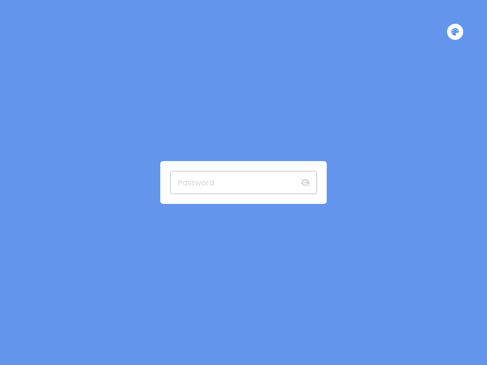

# JS-ShowHidePassword

Show and Hide Password using HTML, CSS and JavaScript
<a href = "https://issakass.github.io/JS-ShowHidePassword/">↪ Live Demo</a>

- Well designed UI in HTML and CSS.
- Click on the eye icon to show/hide password.
- Click on the theme button (top right corner) to open the theme menu. Click on a color to change the background.
